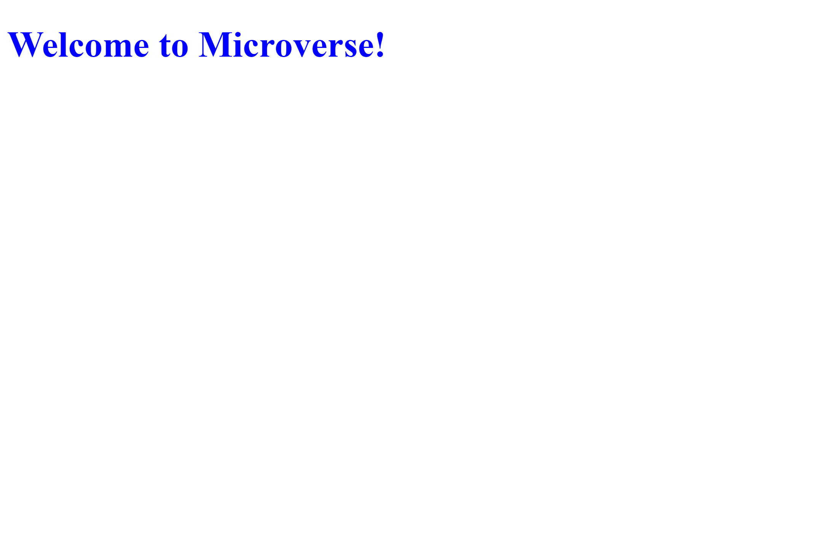

Microverse First Project

The goal of the project is to create a simple html style tage with h1 element. 

## Built With

- HTML, CSS
- WebHint, StyleLint packages are used to check for linter errors
- Visual Studio

## Live Demo

[Live Demo Link](https://medini-rajendra.github.io/helloworld/)

## Setup 
- git clone https://github.com/Medini-Rajendra/helloworld.git
- cd into the folder
- git checkout recreate_webpage
- open `index.html` with live server

## Authors
Rajendra Medini
- GitHub: [@Medini-Rajendra](https://github.com/Medini-Rajendra)
- Twitter: [@invenire512](https://twitter.com/invenire512)
- LinkedIn: [LinkedIn](https://www.linkedin.com/in/medinichaitanya/)

## 📝 License

This project is [MIT](./MIT.md) licensed.
